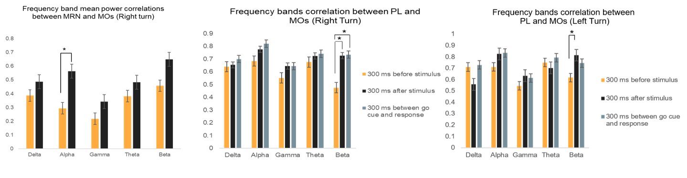

# Portfolio
---
## Hand pose prediction from ECoG signals

A multi-class classification model to predict Hand poses of the famous Rock, Paper, Scissors game using electrocorticography signals. The model achieved 96% accuracy in classification using minimal pre-processing which makes it suitable for realtime prediction.
 

---
## Analysis of functional connectivity during decision making

 Functional connectivity was explored using correlation analyses between secondary motor cortex (MOs) and two other brain areas: Prelimbic area (PL) and Midbrain Reticular Nucleus (MRN) during decision making in mice. The results revealed the synchronization of particular frequency bands between the brain areas choice selection. This project was performed as part of Computational Neuroscience summer school (2020) organized by Neuromatch Academy.  
 

