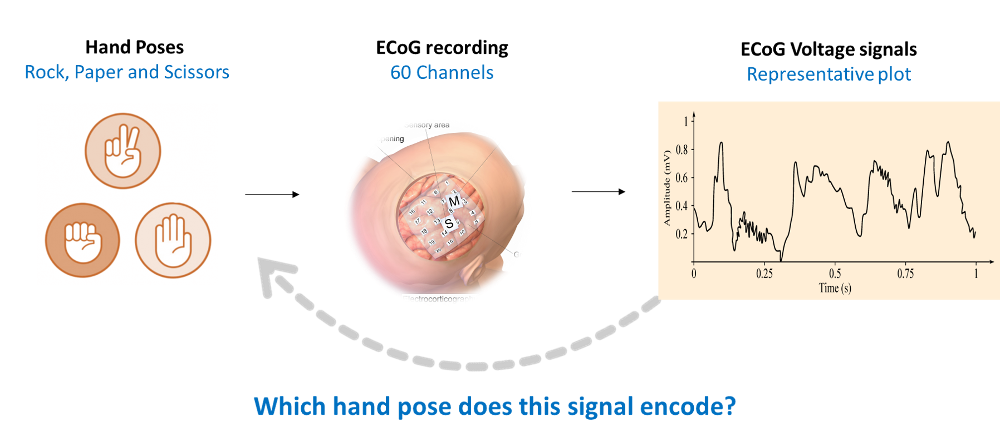
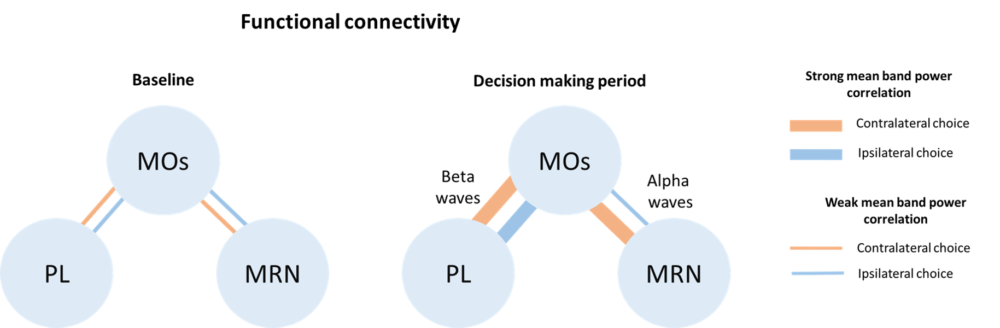
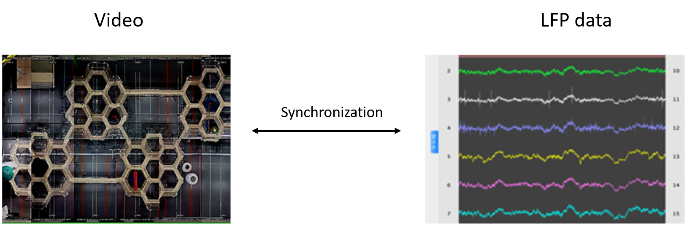
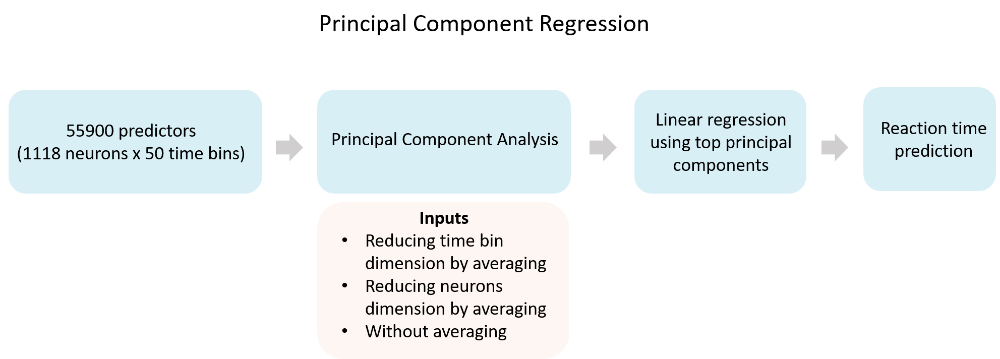

# Portfolio
---
## Hand pose prediction from ECoG signals

A multi-class classification model to predict Hand poses of the famous Rock, Paper, Scissors game using electrocorticography signals. The model achieved 96% accuracy in classification using minimal pre-processing which makes it suitable for realtime prediction.
 

 

---
## Functional connectivity during decision making

 Functional connectivity was explored using correlation analyses between secondary motor cortex (MOs) and two other brain areas: Prelimbic area (PL) and Midbrain Reticular Nucleus (MRN) during decision making in mice. The results revealed the synchronization of particular frequency bands between the brain areas choice selection. This project was performed as part of Computational Neuroscience summer school (2020) organized by Neuromatch Academy.  
 

 

---
## Synchronization of electrophysiological and video data 

 

 The goal of this project was to set up a synchronization pipeline for the electrophysiological and behavioural data from rodent experiments. My contribution involved writing python scripts using signal processing and computer vision principles to extract information and performing windowed time-lagged cross correlation for synchronization. This project was performed as part of a remote internship at Genzel lab in Radboud University. 

 

---

## Predicting reaction time from neuronal spikes

 We tested the possibility of predicting time taken to react by mice to turn a wheel in response to a visual stimuli based on visual cortex activity using Principle Component Regression. The results showed the information in the visual cortex is inadequate to predict reaction times. This project was performed as part of Computational Neuroscience summer school (2021) organized by Neuromatch Academy.  
 

 

---
## Linear Mixed Model Analysis - a short intro

](https://1drv.ms/p/s!AgbbRljQ3mqkgr0BLviW0uCHiZp6bw?e=YBygE5)

 I have explained the need to use Linear mixed model analysis in a biological expeirment to account for the inter-animal differences that could alter the effect of a treatment. The presentation includes a step by step presentation to perform the anlaysis in R package lme4 and JASP software. A comparison of the results obtained in both is also included.  
 

 
